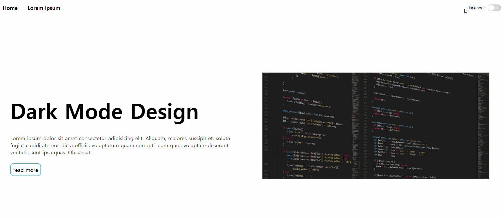

# Dark Mode Web Design

## 프로젝트 소개
이전에 구현한 Toggle Switch button을 이용하여 DarkMode web Design 구현

## 사용언어
- HTML
- CSS
- JavaScript

## 구현 방법
1. toggle switch button을 이용하여 다크 모드를 on할 시 JavaScript를 이용해서 darkmode class를 부여함
2. Css에서 darkmode클래스와 기본 클래스와 다른 다크 모드 색상을 적용해줌 
3. 다크모드를 off할 시 부여  했던 darkmode class를 삭제해줌

## 완성본
