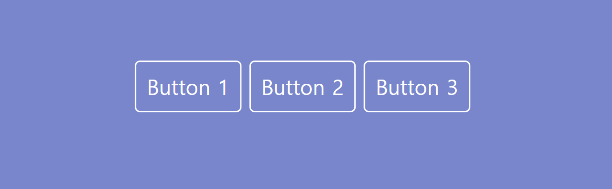

# JavaScript를 이용하여 모달창 띄우기
## 프로젝트 소개
- 버튼을 클릭시 화면 중앙에 모달창을 띄움
- 무슨 버튼을 클릭했는지에 따라 버튼에 알맞은 모달창 내용을 보여줌
- x키 뿐만아니라 빈 여백을 클릭해도 닫히도록 설정

## 사용 언어
- HTML 
- CSS
- JavaScript

## 구현 방법
- 모달창의 html구조를 미리 작성 후 display : none으로 보이지 않게 함
- 버튼 클릭 시 어떤 버튼을 클릭했는지 클릭 이벤트의 인수로 넘겨줌
- 미리 딕셔너리 자료형을 이용하여 버튼 번호에 맞는 내용을 value값으로 저장함
- 클릭 이벤트 발생 시 넘겨진 인수를 key로 알맞은 설명의 내용을 딕셔너리에서 찾음
- 찾은 내용을 기반으로 html의 내용을 변경해줌
- x버튼 (close 버튼) 및 빈 여백을 클릭 시 (window.onclick) display를 다시 none으로 바꿔줌

## 완성본
